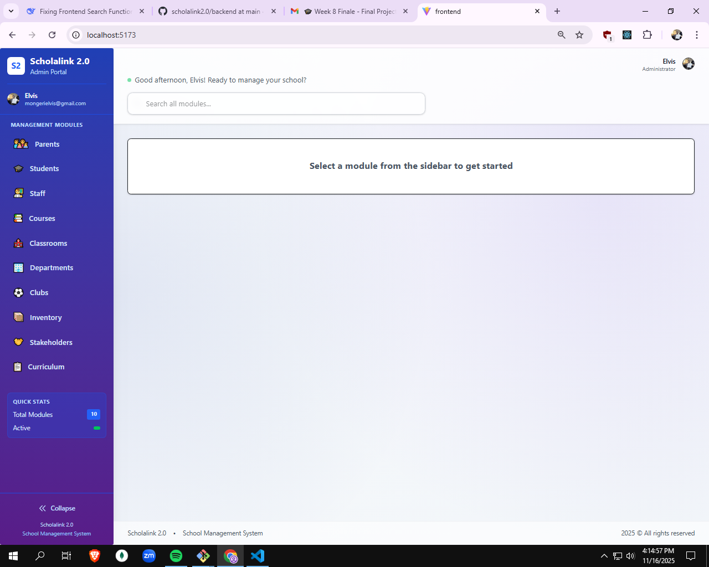
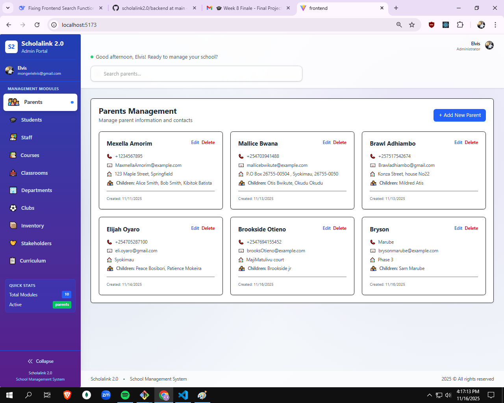
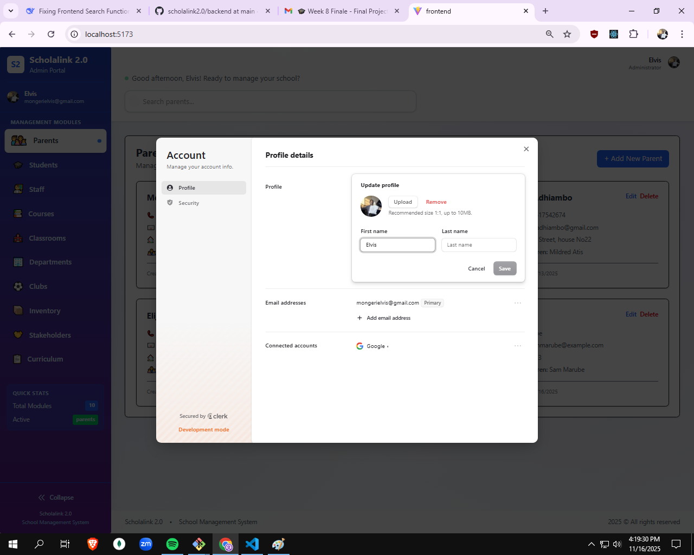
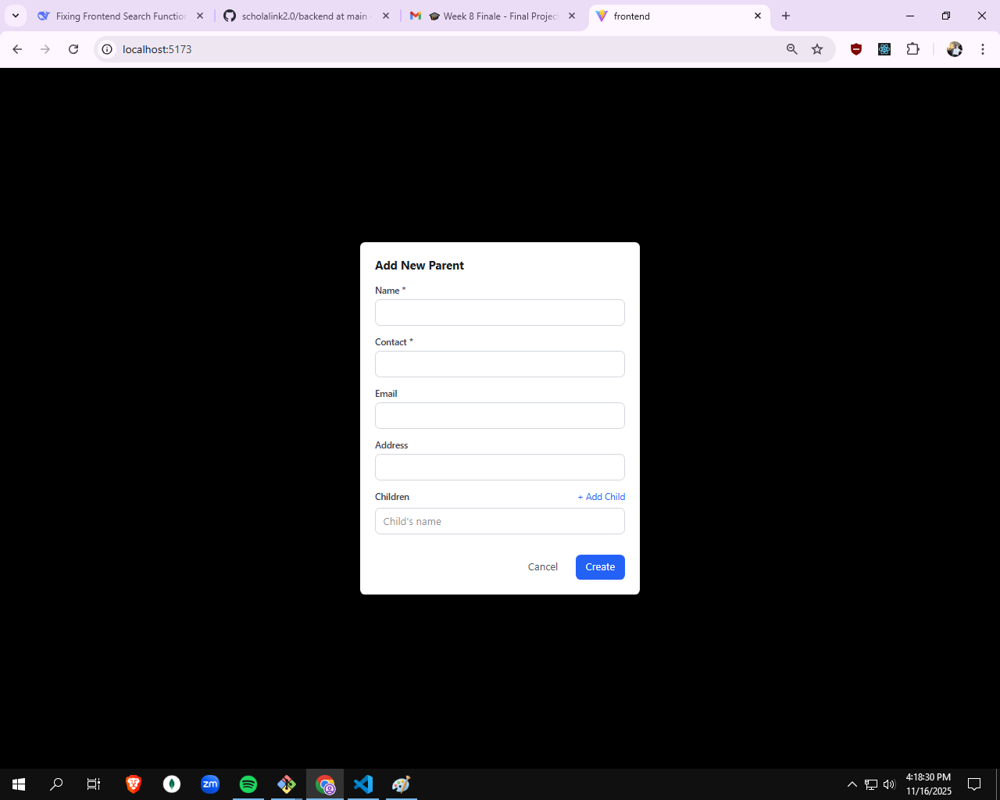

# Scholalink 2.0 Frontend

A modern React-based frontend application for the Scholalink 2.0 school management system. Built with Vite for fast development, featuring a responsive UI with Tailwind CSS and Radix UI components, integrated authentication via Clerk, and comprehensive views for managing school entities.

## Features

- **Authentication**: Seamless login and user management with Clerk
- **Responsive Design**: Mobile-first UI built with Tailwind CSS and Radix UI
- **Entity Management**: Dedicated views for students, staff, courses, classrooms, and more
- **Search Functionality**: Global search across all entities
- **Dashboard**: Centralized dashboard for overview and quick access
- **API Integration**: Axios-based HTTP client for backend communication
- **Routing**: Client-side routing with React Router DOM
- **Development Tools**: ESLint for code quality, Vite for fast builds

### Supported Views

- Dashboard
- Students Management
- Staff Management
- Courses Management
- Classrooms Management
- Clubs Management
- Curriculums Management
- Departments Management
- Parents Management
- Stakeholders Management
- Inventory Management
- Global Search

## Tech Stack

- **Framework**: React v19.2.0
- **Build Tool**: Vite v7.2.2
- **Styling**: Tailwind CSS v4.1.17
- **UI Components**: Radix UI Themes v3.2.1
- **Authentication**: Clerk React v5.55.0
- **HTTP Client**: Axios v1.13.2
- **Routing**: React Router DOM v7.9.5
- **Utilities**: clsx v2.1.1
- **Development**: ESLint, PostCSS, Autoprefixer

## Prerequisites

Before running this application, ensure you have the following installed:

- Node.js (v16 or higher)
- npm (Node Package Manager)
- Backend API running (refer to backend README)

## Installation

1. Clone the repository and navigate to the frontend directory:
   ```bash
   cd frontend
   ```

2. Install all dependencies using npm:
   ```bash
   npm install
   ```

   This will install the following packages:

   **Dependencies:**
   - `@clerk/clerk-react`: ^5.55.0 - Clerk React SDK for authentication
   - `@radix-ui/themes`: ^3.2.1 - Radix UI theme components
   - `axios`: ^1.13.2 - HTTP client for API requests
   - `clsx`: ^2.1.1 - Utility for conditional CSS classes
   - `react`: ^19.2.0 - React library
   - `react-dom`: ^19.2.0 - React DOM rendering
   - `react-router-dom`: ^7.9.5 - Declarative routing for React

   **DevDependencies:**
   - `@eslint/js`: ^9.39.1 - ESLint JavaScript configuration
   - `@tailwindcss/postcss`: ^4.1.17 - Tailwind CSS PostCSS plugin
   - `@tailwindcss/vite`: ^4.1.17 - Tailwind CSS Vite plugin
   - `@types/react`: ^19.2.2 - TypeScript types for React
   - `@types/react-dom`: ^19.2.2 - TypeScript types for React DOM
   - `@vitejs/plugin-react`: ^5.1.0 - Vite plugin for React
   - `autoprefixer`: ^10.4.22 - PostCSS plugin for CSS vendor prefixes
   - `eslint`: ^9.39.1 - JavaScript linter
   - `eslint-plugin-react-hooks`: ^5.2.0 - ESLint plugin for React hooks
   - `eslint-plugin-react-refresh`: ^0.4.24 - ESLint plugin for React Fast Refresh
   - `globals`: ^16.5.0 - Global variables for ESLint
   - `postcss`: ^8.5.6 - CSS post-processing tool
   - `tailwindcss`: ^4.1.17 - Utility-first CSS framework
   - `vite`: ^7.2.2 - Fast build tool and dev server

## Environment Setup

1. Copy the environment file:
   ```bash
   cp .env .env.local
   ```

2. Update the `.env.local` file with your actual values:
   ```
   VITE_CLERK_PUBLISHABLE_KEY=your_clerk_publishable_key
   VITE_API_BASE_URL=your api url base
   ```

   - `VITE_CLERK_PUBLISHABLE_KEY`: Your Clerk publishable key (must be prefixed with VITE_ for Vite)
   - `VITE_API_BASE_URL`: Base URL for the backend API

## Running the Application

### Development Mode
```bash
npm run dev
```
Starts the Vite development server with hot module replacement.

### Production Build
```bash
npm run build
```
Builds the application for production in the `dist` directory.

### Preview Production Build
```bash
npm run preview
```
Serves the production build locally for testing.

### Start with Host Access
```bash
npm run start
```
Starts the development server accessible from other devices on the network.

### Linting
```bash
npm run lint
```
Runs ESLint to check code quality and style.

The development server typically runs on `http://localhost:5173`.

## Project Structure

```
frontend/
├── public/
│   └── vite.svg                 # Vite logo asset
├── src/
│   ├── assets/
│   │   └── react.svg            # React logo asset
│   ├── components/              # Reusable UI components
│   │   ├── layout/
│   │   │   ├── ModelView.jsx    # Modal view component
│   │   │   └── Sidebar.jsx      # Sidebar navigation
│   │   ├── models/              # Entity-specific view components
│   │   │   ├── ClassroomsView.jsx
│   │   │   ├── ClubsView.jsx
│   │   │   ├── CoursesView.jsx
│   │   │   ├── CurriculumView.jsx
│   │   │   ├── DepartmentsView.jsx
│   │   │   ├── InventoryView.jsx
│   │   │   ├── ParentsView.jsx
│   │   │   ├── StaffView.jsx
│   │   │   ├── StakeholdersView.jsx
│   │   │   └── StudentsView.jsx
│   │   └── search/
│   │       └── GlobalSearch.jsx  # Global search component
│   ├── hooks/                   # Custom React hooks
│   │   ├── useAPI.js            # API interaction hook
│   │   └── useAuthSetup.js      # Authentication setup hook
│   ├── pages/                   # Page components
│   │   ├── auth/
│   │   │   └── Login.jsx        # Login page
│   │   └── dashboards/
│   │       └── Dashboard.jsx    # Main dashboard
│   ├── services/
│   │   └── api.js               # API service functions
│   ├── utils/
│   │   └── searchUtils.js       # Search utility functions
│   ├── App.css                  # Application styles
│   ├── App.jsx                  # Main App component
│   ├── index.css                # Global styles
│   └── main.jsx                 # Application entry point
├── .env                         # Environment variables (create .env.local)
├── .gitignore                   # Git ignore rules
├── eslint.config.js             # ESLint configuration
├── index.html                   # HTML template
├── package.json                 # Project dependencies and scripts
├── package-lock.json            # Lockfile for dependencies
├── postcss.config.js            # PostCSS configuration
├── README.md                    # This file
├── tailwind.config.js           # Tailwind CSS configuration
└── vite.config.js               # Vite configuration
```

## Configuration Files

- **vite.config.js**: Vite configuration with React and Tailwind plugins
- **tailwind.config.js**: Tailwind CSS configuration
- **postcss.config.js**: PostCSS configuration with Autoprefixer
- **eslint.config.js**: ESLint configuration for code quality

## API Integration

The frontend communicates with the backend API using Axios. All API calls are handled through the `useAPI` hook and `api.js` service file. Ensure the backend is running and the `VITE_API_BASE_URL` is correctly set.

## Authentication

User authentication is managed through Clerk. The `useAuthSetup` hook handles authentication state and setup.

## Styling

The application uses Tailwind CSS for utility-first styling, combined with Radix UI components for consistent theming. Global styles are defined in `index.css` and component-specific styles in `App.css`.

## Contributing

1. Follow the existing code style and run `npm run lint` before committing
2. Use the provided hooks and services for API interactions
3. Maintain component organization in the appropriate directories
4. Test your changes in development mode

## Screenshots

### A landing page on the frontend app


### A parent control Module for Demostration


### Clerk Account Control


### Basic Create page
